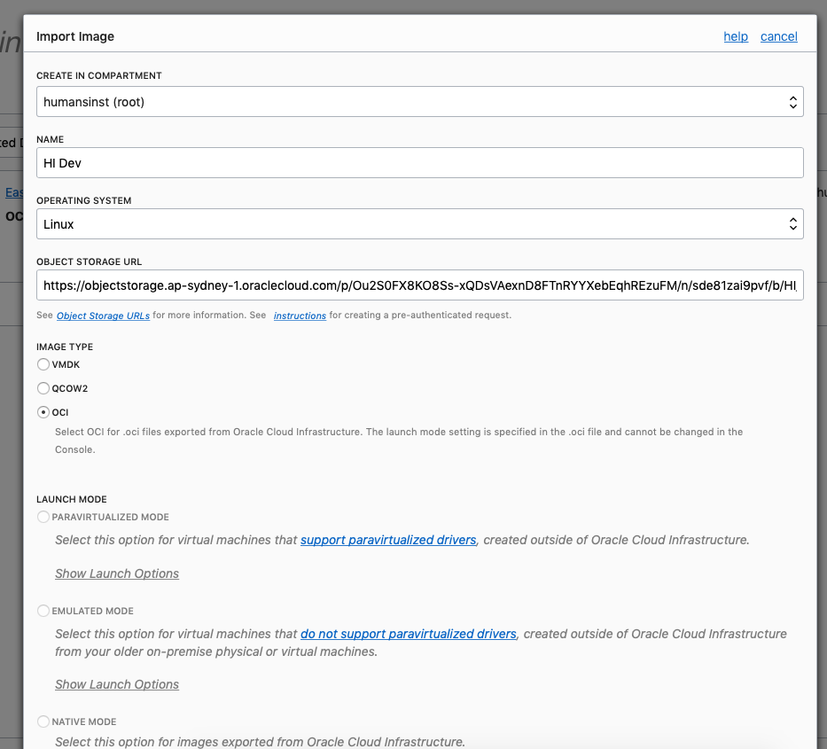

# A Free (forever) Cloud Based Jupyter data science development environment in 10 steps!

Wow, that is not the snappiest title I've ever written! But it is descriptive, so if that's what you're after, hold tight!

Recently I got into a conversation with a data scientist who told me one time consuming part of their job was to paraphrase...

> "get people setup with an environment they can play around in and get used to the tools"

Could we package and deploy a simple developer environment with minimal fuss with a number of useful tools ready to go.

Conversation took the many turns it often does, but an option I thought would be pretty useful would be to leverage Oracle's recently announced "[Always Free Tier](http://oracle.com/cloud/free)" to build a training environment that could be given out far and wide and wouldn't go away after a year!

So I set myself the task of seeing if there was an easy way to get this done and allow other people to replicate this. The astute amongst you will realise this article is the output of that guide :)

---

The outcomes we're after are:

* A free computer in the sky.
* Always on.
* Accessible and ready-to-go from work, home or mobile (tablet).
* Accessible either via SSH (apps, terminal) or VNC for GUI when required.
* Jupyter notebook server to act as a remote data science development / test environment.
* **Bonus** remote VS Code server for generic development and scripting efforts.

**The pre-requisites are:** 

1) [Oracle Always Free Tier Account.](http://oracle.com/cloud/free)
2) [An SSH key-pair](https://docs.oracle.com/en/cloud/paas/database-dbaas-cloud/csdbi/generate-ssh-key-pair.html#GUID-69EF7E8A-7CD5-482E-A878-882EA21DE2B8)
3) [An hour or so spare :)](https://www.google.com/url?sa=t&rct=j&q=&esrc=s&source=web&cd=1&cad=rja&uact=8&ved=2ahUKEwjR0f67mI7mAhUPfH0KHa95DwIQFjAAegQIARAB&url=https%3A%2F%2Fgettingthingsdone.com%2F&usg=AOvVaw29xE4PaNOode2uC-m_4EyX)

---

## Step 1: Log into your OCI Free Tier**

I like to think of VMs here as a couple of free raspberry pi's in the sky.  Great for experimenting with little projects and setting up useful cloud hosted services for yourself!

## Step 2: Import the base dev image

I created an empty Ubuntu 18.04 image which comes pre-loaded with a few useful tools for VNC / desktop access which isn't a bad start. Over time I'll add links in this repo to other images that I find useful, generally pre-configured with a few more useful tools.

* Import a custom image (Menu > Compute > Custom Images).
* Click import, fill in the form 
* In "Object Storage URL" Paste: [this Link](https://objectstorage.ap-sydney-1.oraclecloud.com/p/Ou2S0FX8KO8Ss-xQDsVAexnD8FTnRYYXebEqhREzuFM/n/sde81zai9pvf/b/HI_Bucket/o/DevBuntsImage).
* Select image type OCI.

This will take a little while to pull the image, so in the meantime we can do something else.

## Step 3: Setup a public IP

W're going ot need access remotely so via SSH so we'll need a public IP.  Lets grab one of those.

* Navigate to Menu > Networking > Public IPs.
* Create a public IP.

## Step 4: Create a free VM compute instance

Ok this is where we spin up one of our two always free VMs, however, we'll want the import of our image to be finished, once that's done:

* Navigate to Compute > Instances > Create Instance.
* Give it a catchy name - "OracleCoolDevEnviromement".
* Click "Change Image Source > Custom Image" Choose the image you just imported.
* The free tier shape should already be selected.
* Copy in your SSH **Public** Key.

[Choose the Image and Shape](Assets/849E86B3-E207-4480-BC26-C5114F8D0197.png)

## Step 5: Assign a Public IP

If we're going to access this outside the cloud console we're going to need a public IP. 

* Navigate to "Instance > Details > Attached VNICs > VNIC Details > IP Addresses".
* From the ... menu click to edit the existing private IP address.
* Select "reserved public IP" and select the IP address you generated in step 3.

## Step 6: Log in / Create an SSH tunnel

I've only tried this on mac and linux as that's what's available to me but the idea here is to log into the remote box and create an SSH tunnel which maps our local port 8888 to that of the remote machine. We're going with this extra step so that we can access our Jupyter server through this port mapping. 

Simply fire up a terminal on your local machine with the following command:

`ssh -L :8888:localhost:8888 ubuntu@<ip_address> -i <ssh_private_key_name>)`

The `<ip_address>` is your public IP address which you can record from your instance details.  
The `<ssh_private_key_name>` is the name of the private key on your local machine [see guide if you missed it earlier](https://docs.oracle.com/en/cloud/paas/database-dbaas-cloud/csdbi/generate-ssh-key-pair.html#GUID-69EF7E8A-7CD5-482E-A878-882EA21DE2B8).

## Step 7: Fire up the notebooks and connect

After the terminal connects to the remote box, we've now got a secure connection to the box and can kick off hte pre-installed Jupyter Server.  Simply enter

`jupyter notebook`

This will fire up jupyter with a server on localhost:8888 which we have already conveniently mapped to our own localhost:8888. Did someone say, **Bish, Bash, Bosh?**

## Step 8: Connect to Remote Notebook Server

Click / copy the link in terminal into your browser to log in! 

It will be of the format of...

* http://localhost:8888/?token=biglongtokenoincludingnumbers78708678andletterssfslkfj

This will fire up a jupyter notebook in your local browser, with all code, files and exectuion taking place in the cloud, securely accessed through the SSH tunnel.

Now you're ready to get started!

## Step 9: The Bonus Round!

**VS Code Server** You may want to do some work outside notebooks for which a remote VS Code sever is a good option and is already installed on the server. This [youtube video gives you a good overview of how to set that up](https://www.youtube.com/watch?v=lKXMyln_5q4) and can be configured pretty easily for you're remote instance.

**VNC Access** Sometimes you just want a gui and luckilly we've already pre-configured everything you need here. [See the end of this guide for details on how to connect](https://youtu.be/Kb6v1GqeAc0?t=336)

Bonus points to anyone who follows this though and I'll write up a quick summary of that soon in another article.

## Step 10: Share your experience and your requirements!

The point of this repo is to gather to gether a range of opensource / creative commons guides and images for working with OCI Free Tier (and paid services).

So, we ask one simple question, please share your experience and make some requests for other images you'd love to see pre-configured for deployment!
