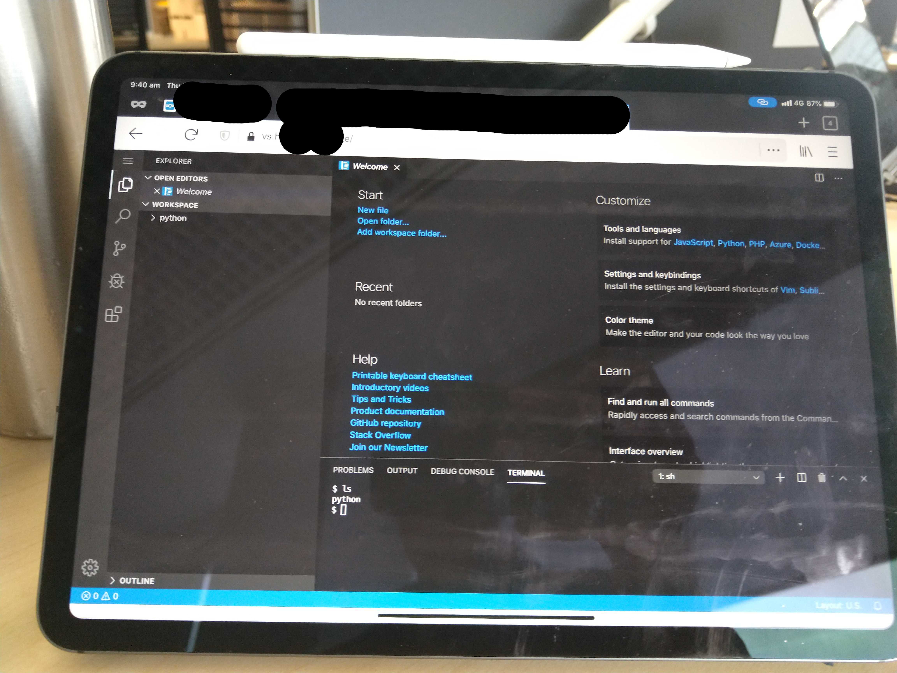
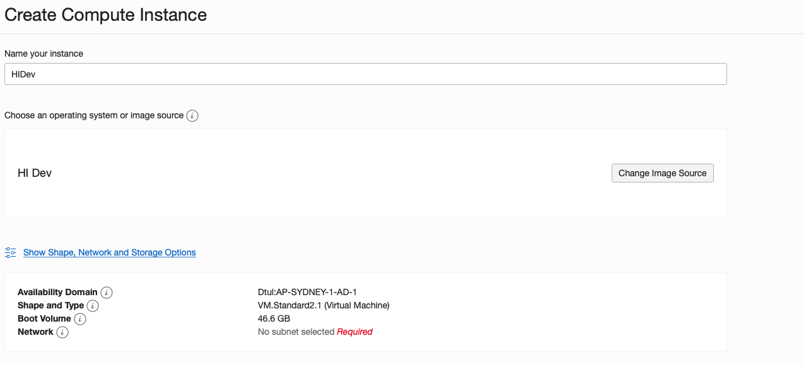
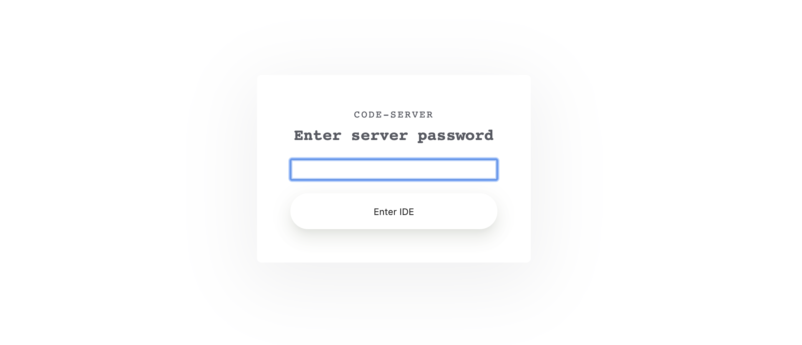

# Run VS Code development environment on your iPad!

Sometimes you just want a bit of flexibility in your coding environment.

Maybe you're travelling, maybe you just can't be bothered to lug your machine home and just want to work from a Chromebook on the couch. Maybe you've got a cheeky raspberry pi or Pinebook Pro laptop (I have one and they're awesome) and you just don't want to deal with the intricacies of arm vs. x64 architectuers...

Well, what if you could just load a generic web browser and pick up where you left off wether its on your iPad, Chromebook, Pi, Pinebook or wherever.

Better yet, what if it was free?

Well as luck would have it there's a quick, free workaround available via Oracle Free Tier, Docker and the open source Code Server!

Check it out!



---

### Let's get started

The outcomes we're after are:

*   A free computer in the sky.
*   A full x64 dev enviroment.
*   Accessible and ready-to-go from work, home or mobile (tablet).
*   VS Code as graphical IDE.
*   Secure encrypted access via SSL.

**The pre-requisites are:**

1.  [Oracle Always Free Tier Account.](http://oracle.com/cloud/free)
2.  [An SSH key-pair](https://docs.oracle.com/en/cloud/paas/database-dbaas-cloud/csdbi/generate-ssh-key-pair.html#GUID-69EF7E8A-7CD5-482E-A878-882EA21DE2B8)
3.  [An hour or so spare :)](https://www.google.com/url?sa=t&rct=j&q=&esrc=s&source=web&cd=1&cad=rja&uact=8&ved=2ahUKEwjR0f67mI7mAhUPfH0KHa95DwIQFjAAegQIARAB&url=https%3A%2F%2Fgettingthingsdone.com%2F&usg=AOvVaw29xE4PaNOode2uC-m_4EyX)

---

## Step 1: Log into your OCI Free Tier

I like to think of VMs here as a couple of free raspberry pi's in the sky. Great for experimenting with little projects and setting up useful cloud hosted services for yourself!

## Step 2: Create a free VM compute instance

Ok this is where we spin up one of our two always free VMs, however, we'll want the import of our image to be finished, once that's done:

*   Navigate to Compute > Instances > Create Instance.
*   Give it a catchy name - "OracleCoolDevEnviromement".
*   Click "Change Image Source > Ubuntu 18.04 Minimal" Choose the image you just imported.
*   The free tier shape should already be selected.
*   Clik to assign a public IP
*   Copy in your SSH **Public** Key.



## Step 3: Assign a domain / subdomain!

To add secure access via https we're going to assign a subdomain here and use a reverse proxy to route through to the service. Simply put, go to a service like godaddy and buy a domain or point a subdomain you own to your server.

In this case - you'll want ot create an A record in you DNS akin to `@ point to IP` for domain.com `vs points to <IP Address>` for vs.domain.com

***Bonus round:*** From this point you can now log into the ssh into the box using this domian redirect instead of the ip address (i.e. ssh ubuntu@vs.domain.com -i <yourkey>)

## Step 4: Setup Port Forwarding on the Cloud

Now we head to the Oracle Cloud Console to set up the port forwarding rules so that traffic can even get to the server in the first place!

1.  Menu > Compute > Instances > Select the instnace you created
2.  Click on the VCN title from the instance details page
3.  Click on "security lists" in the left hand menu
4.  Select the default security list
5.  Create two new rules for traffic from 0.0.0.0/0 (means anywhere) to port 80 and port 443 respectively.


This is just going to let us access the server through https and http and we'll use a reverse proxy to take care of everything from there.

## Step 5: Install Docker!

to keep things simple and segregated on teh server we're going to use Docker to run a reverse proxy, an simple SSL encryption helper and then the build a VS Code server in a container.

We won't go into the details of setting up Docker, but quick links as follows.

*   SSH into your new box e.g. `ssh ubuntu@vs.domain.com -i <yourkey>`
*   Update the machine `sudo apt-get update` and `sudo apt-get upgrade`
*   Install docker: see here -> https://docs.docker.com/install/linux/docker-ce/ubuntu/
*   To run docker withotu SUDO: `sudo usermod -aG docker ${USER}`
*   Install docker-compose: https://docs.docker.com/compose/install/

## Step 6: Define your docker containers

OK, now we have docker we can actually start to get things up and running.

So first things first, on your free tier box create a directory called proxy and create file called docker-compose.yml.

```
mkdir proxycd proxy nano docker-compose.yml
```

In the nano window you can then paste in the script below.

```
version: '2'

services:

  proxy:
    image: jwilder/nginx-proxy
    container_name: proxy
    restart: unless-stopped
    labels:
      com.github.jrcs.letsencrypt_nginx_proxy_companion.nginx_proxy: "true"
    volumes:
      - /var/run/docker.sock:/tmp/docker.sock:ro
      - certs:/etc/nginx/certs:rw
      - vhost.d:/etc/nginx/vhost.d
      - html:/usr/share/nginx/html
      - ./uploadsize.conf:/etc/nginx/conf.d/uploadsize.conf:ro
    ports:
      - "80:80"
      - "443:443"
    networks:
      - "default"
      - "proxy-tier"

  proxy-letsencrypt:
    image: jrcs/letsencrypt-nginx-proxy-companion
    container_name: letsencrypt
    restart: unless-stopped
    environment:
      - NGINX_PROXY_CONTAINER=proxy
    volumes:
      - /var/run/docker.sock:/var/run/docker.sock:ro
    volumes_from:
      - "proxy"
    depends_on:
      - "proxy"
    networks:
      - "default"
      - "proxy-tier"

  code-server:
    image: linuxserver/code-server
    container_name: code-server
    restart: unless-stopped
    environment:
      - PUID=1000
      - PGID=1000
      - TZ=Australia/wherever
      - VIRTUAL_HOST=<vs.domain.com>
      - LETSENCRYPT_HOST=<vs.domain.com>
      - LETSENCRYPT_EMAIL=<email@domain.com>
      - PASSWORD=<yourpassword>
      - SUDO_PASSWORD=<yoursudopassword>
    volumes:
      - /codeserver/config:/config
    ports:
      - 8443:8443

volumes:
  certs:
  vhost.d:
  html:

networks:
  proxy-tier:
```

This code will do the heavy lifting to automate the build of everything you need, but you'll want to change a few variables:

*   TZ=Australia/wherever
    Replace everything after the = with your timezone info.
    
*   VIRTUAL_HOST=<vs.domain.com>  
    replace the <> with your domain you set up earlier.
    
*   LETSENCRYPT_HOST=<vs.domain.com>
    replace the <> with your domain you set up earlier.
    
*   LETSENCRYPT_EMAIL=[email@domain.com](mailto:email@domain.com) Email associated with this domain.
    
*   PASSWORD=
    Password access to your dev environment over the web.
    
*   SUDO_PASSWORD=
    used in accessing root user in the dev environment.
    

Once thats done hit `ctrl+x` and select yes to save.

## Step 7: Fire it up

Now the magic.

In your proxy directory simple run `docker-compose up -d`

This will go and pull all of the relevant images over hte internet and build out the environmetn as specified in the file.

Once it's done, you can check the containers are up and running with: `docker ps`

Well done you now have a web based IDE :)

## Step 8: Log in and get cracking!

So next step is to log in and get cracking.

Head to <vs.your.domain> and you'll be prompted for the password you specified in your docker-compose.yml file.



So log in, install what you need andget coding knowing you can take your work with you wherever you go!

---

## Step 9: Bonus Round!

The point of this repo is to gather together a range of opensource / creative commons guides and images for working with OCI Free Tier - also works on paid services ;-).

So, we ask one simple question, please share your experience and make some requests for other images you'd love to see pre-configured for deployment!

All material on this site is licensed under a [Creative Commons BY-SA 4.0](https://creativecommons.org/licenses/by-sa/4.0/)
